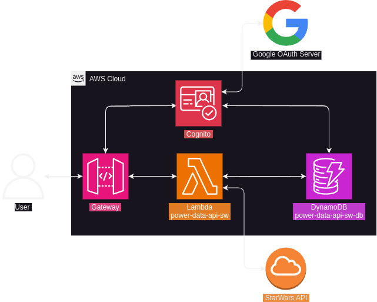

# power-data-api-sw
API for PowerData task. It interacts with [SWAPI](https://swapi.dev/).

# Future features
- Add deployment with AWS ECR;
- Users can add favorites items;
- Users can add new items.
